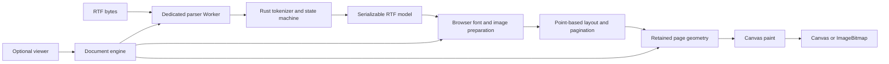

# Architecture

Status: implemented v1 M0–M2 rendering path, with partial format coverage listed in the support matrix. Future sections in this document are labeled M3 or later.

## Boundaries and flow

One Cargo workspace contains `crates/rtf-parser`. One pnpm workspace contains `packages/rtf-viewer` and `examples/viewer`. The pinned upstream submodule under `third-party/office-open-xml-viewer/upstream` supplies image-header source only; its pnpm/Cargo workspaces are not members of ours and are never installed or built. Isolated research experiments remain outside the production workspaces.

Rust exports a bounded byte-to-model function through wasm-bindgen. Lexical scanning and scoped interpretation are methods in one parser module, not separate packages. The WASM boundary returns serde JSON, which the Worker parses into the generated TypeScript model; this intentionally preserves null/array semantics at the cost of an intermediate string. The parser scans control tokens without first decoding the whole document. It clones scoped state on `{`, restores on `}`, consumes `bin` payloads by byte count, and distinguishes destinations from formatting. Text byte runs are decoded only after resolving the active document/font codepage. Escaped bytes remain contiguous for multibyte decoding. Unicode fallback skipping counts RTF tokens as required by pp. 14–15, including one entire binary token, and terminates at braces. UTF-16 surrogate pairs are combined. Unknown ignorable destinations are skipped as groups, with diagnostics.

Rust resolves character and paragraph defaults and direct formatting. `plain` resets character properties without resetting paragraph properties; `pard` resets paragraph properties without resetting character properties. Named stylesheet inheritance is a separate future feature and is diagnosed rather than invented. Default paper is 612 × 792 pt with 90 pt left/right and 72 pt top/bottom margins (spec p. 49).

## Contracts

Rust models derive serde and ts-rs declarations. A generator emits the complete TS model into `src/generated/model.ts`; a check regenerates and compares byte-for-byte. The Worker protocol imports that generated model. A numeric schema version protects the runtime boundary.

The initial model contains page settings; font/color tables; resolved paragraph text/image runs; explicit page-break blocks; bounded embedded image bytes; diagnostics with code, message and byte offset. Paragraph-mark style is retained for empty-line metrics. RTF-specific properties stay RTF-specific. It contains neither OOXML relationship IDs nor fabricated sections/styles.

The layout result contains pages, physical page sizes, line rectangles, text fragments (font string, baseline, measured advance and decorations), and image rectangles addressed by resource ID. Geometry contains no Canvas, DOM, image object or WASM reference. Layout can be serialized and reused at any output resolution. A diagnostic records content too large for a usable page; iteration must always make progress.

## Text and fonts

The browser resource layer selects a CSS family from an explicit caller font mapping, the RTF font name and a local generic fallback. It waits for the fonts used in the document through the Font Loading API before measurement. The library registers no remote fonts and performs no external font search. Test fonts are explicitly supplied by the test application.

Measurement uses Canvas 2D at one logical point per canvas unit, with CSS font strings using the corresponding `px` numeric size. The same string, kerning and baseline configuration are stored in layout and used in paint. This avoids mixing CSS points, browser 96-DPI conversions and canvas units. Single-line height uses measured font ascent/descent where available, with a documented fallback. Exact, minimum and multiple line spacing are distinguished.

Line breaking preserves grapheme clusters, permits ordinary word boundaries and common CJK boundaries, and records line geometry once. Full Unicode bidi, Arabic shaping across style runs, dictionary breaking and complete East Asian typography remain separate fidelity work. Diagnostics disclose such limits. The initial common-Latin/CJK behavior is tested with known fonts.

A font epoch is tracked from resource construction, before measurement starts. Font completions invalidate layout when a face matches a family used by text, paragraph marks or fallback, or when its relevance cannot be established. Empty completion events and known unrelated families do not invalidate layout. Completed faces explicitly awaited during font preparation are tracked weakly: their delayed completion events cannot invalidate geometry that already uses them. Matching remains conservative across weight, style and character coverage. `relayout()` rebuilds geometry explicitly and increments a revision; rendering rejects stale layout until refreshed. Hosts observe `needsRelayout` after font completion and coordinate page-count/cache replacement with an explicit relayout, as shown in the [API reference](api.md#fonts-resolution-and-lifecycle). Changes without a browser completion event require explicit relayout too. Relayout is transactional: old geometry remains until successful replacement, and destroy/abort discard late results. If the epoch changes during layout, that attempt rejects; it cannot publish mixed font metrics.

## Pagination

Twips convert to points at the semantic boundary (20 twips = 1 pt); half-points convert to points for font sizes. Layout never receives scale/PPI/DPR. It accounts for usable width, first-line/hanging indents, alignment, before/after spacing, explicit line breaks and explicit pages. Lines are fragmented across pages. Every page retains its geometry, so `load()` returns a complete page count.

M3 adds actual row/cell semantics, measured table fragments and row continuation policies. It must not flatten tables and call the result table support. Repeating headers, merges, nested tables and oversized rows require separate acceptance fixtures. Future section/header/footer layout needs additional stories and per-section page settings, not paint-time special cases.

## API and ownership (implemented)

- `RtfDocument.load(Blob | ArrayBuffer | Uint8Array, options)` copies caller byte buffers and resolves after complete pagination. URL strings are intentionally excluded initially; callers can fetch under their own network policy.
- `pageCount`, `getPageSize(index)`, `getPageLayout(index)` and `diagnostics` expose immutable metadata; indexes are zero-based. `renderPage(canvas, index, options)` paints into a caller-owned HTMLCanvasElement or OffscreenCanvas. `renderPageToBitmap(index, options)` returns a caller-owned bitmap.
- Default render PPI is 96; `scale` and `pixelRatio` default to 1. Backing dimensions are the ceiling of physical points × PPI / 72 × scale × pixelRatio, with a four-relative-epsilon tolerance at positive integer boundaries for floating-point overshoot. Fractional extents outside that tolerance still round upward; rounded dimensions must obey the axis and total-pixel bounds. Canvas CSS sizing is the viewer/caller's job. The library never implicitly reads `devicePixelRatio`.
- Each load gets a dedicated parser Worker. Abort rejects with `AbortError`, terminates the Worker immediately, and releases partial resources. Sending a cancel message alone cannot interrupt synchronous WASM. Successful parse also terminates its Worker, freeing its WASM memory.
- The static load has no document to destroy before it resolves; callers cancel through `AbortSignal`. Viewer destroy during load aborts its controller. Load failures and races release provisional resources.
- A document owns prepared image bitmaps and font-event listeners, but not caller canvases, supplied font faces, input bytes or returned bitmaps. `destroy()` is repeatable and frees owned resources. Metadata remains readable; resource operations reject after destroy.
- Different canvas targets can render concurrently. Concurrent work on one canvas rejects to avoid races. Each bitmap request has its own temporary canvas. Cancellation is checked before, between paint batches and after bitmap creation; a late bitmap is closed before rejecting.
- `new RtfViewer(canvas)` owns documents it loads. Replacement aborts previous work and destroys the previous owned document. `RtfViewer.fromDocument(canvas, document)` borrows; load is forbidden in borrowed mode and viewer destroy leaves the document alive. Navigation is generation-guarded.

The [public API contract](api.md#public-api-and-versioning) defines 1.x compatibility for exports, model/layout fields and ownership rules. The semantic model's schema version is separate from npm release versions and the unpublished Rust crate version.

## Resource policy

Initial hard defaults: 16 MiB input, 256 nesting depth, 2 million tokens, 2 million decoded text units, 100,000 blocks including page breaks, 256 embedded images, 8 MiB per image, 32 million decoded image pixels in total, 2,000 pages, and 32 million pixels per output canvas. Additional bounds are 16,384 graphemes per unbroken token, 2,048 pt font size/baseline magnitude and 14,400 pt paper/image dimensions. Each output axis is at most 32,767 pixels. Reject nonfinite/invalid geometry and output parameters. Diagnostics are deduplicated and bounded. These are engineering limits, not RTF specification maxima.

Layout yields periodically so AbortSignal and UI events can run. Image decode promises are not intrinsically abortable; late decoded resources are always closed. Worker parsing timeout and byte bounds prevent a corrupt file from pinning the main thread. OLE and external-field content is never executed or fetched.

## Decisions and assumptions

Use wasm-bindgen `--target web`, ESM assets, native module Workers, generated TS contracts and a Vite example. A local PNG/JPEG adapter imports the original upstream image sniffer through a shared esbuild/Vitest source alias. A compile-time assignment checks the narrow local declaration against the real upstream function; normal behavior tests cover malformed headers, dimensions and EXIF orientation. The implementation is bundled into the npm archive. DOCX layout and the rtf.js top-level graph remain outside the runtime dependency graph; evidence is in [reuse evaluation](reuse-evaluation.md). No submodule is required for npm consumers.

Source development uses Node's native TypeScript execution for two small build configuration files, with separate compiler checks for browser, Worker and Node environments. The Worker resolves against wasm-bindgen's actual generated declaration through a TypeScript `rootDirs` overlay. Cargo owns declaration generation/checking directly. Standard pnpm/npm commands pack and install the archive, Playwright owns its consumer test, and Release Please owns version/changelog/tag generation.

Verified with Vite production output in Chromium, Firefox and WebKit: the encoding and raster-size regressions, font lifecycle, and page/text geometry against one independently exported LibreOffice sample. The separate installed-tarball consumer verifies Worker/WASM rewriting in Chromium. Unverified assumptions: other bundlers; realistic broad CJK/complex-script coverage; Word/TextEdit output; vector metafile fidelity; layout latency at configured upper limits. Common system font names alone cannot guarantee cross-platform pixel equality.

Official tooling sources checked during design: [pnpm workspace](https://pnpm.io/workspaces), [wasm-bindgen deployment](https://wasm-bindgen.github.io/wasm-bindgen/reference/deployment.html), [ts-rs](https://docs.rs/ts-rs/latest/ts_rs/), [Vite guide](https://vite.dev/guide/), [Worker termination](https://developer.mozilla.org/en-US/docs/Web/API/Worker/terminate), [font loading](https://developer.mozilla.org/en-US/docs/Web/API/FontFaceSet/load).
